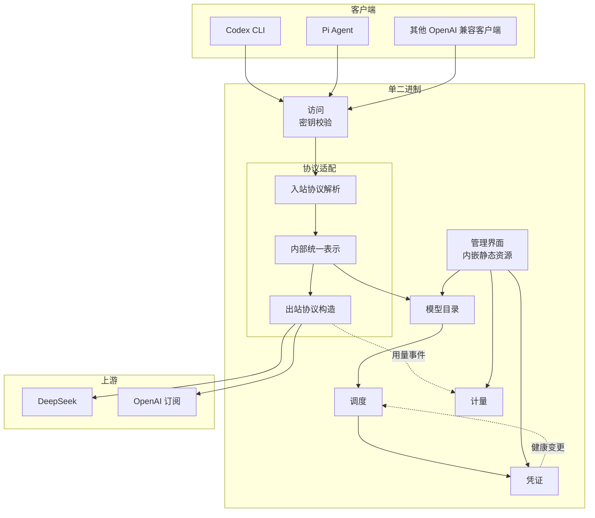

# 系统架构全景

限界上下文划分的模块化单体，内部按 CQRS 垂直切片组织，切片自带入站适配器与用例处理器，入站端口以处理器签名隐式表达；领域层为 DDD 战术模式的充血模型；出站依赖通过端口适配器倒置，端口按读写分离。

## 架构拓扑

协议适配是唯一接触线上协议的地方，入站协议与出站协议都先翻译成内部统一表示再向外，领域模型不感知任何上游协议的字段。

## 技术栈选型

- 运行时与语言：Rust 1.98，单二进制交付，跨 Linux、macOS、Windows
- HTTP 主干：axum + hyper + tower-http + reqwest + tokio。axum 类型隔离在薄适配层，业务逻辑不直接依赖，以应对其 0.9 的破坏性变更
- 持久化：SQLite，WAL 模式，sqlx 访问，迁移脚本随仓库版本化
- 凭据加密：信封加密。每条凭据用随机数据密钥加密，数据密钥再由主密钥包裹后落盘，主密钥取自操作系统凭据库；端口以 `SealedSecret` 承载包裹后的密钥与密文
- 可观测：tracing 做结构化日志，metrics 做指标导出
- 配置：文件承载，SIGHUP 触发重载，arc-swap 原子替换，保留 last-known-good 快照
- 前端：React 19 + Vite 8 + Tailwind v4 + shadcn/ui + TanStack Query + TanStack Table + recharts，构建产物由 rust-embed 嵌入
- 工具链：cargo 构建，just 统一入口，Biome 管前端，cargo-deny 管依赖

## 基础设施

### 入站承载面

入站分为两个面。协议面跟随上游规范，为编码客户端转发模型调用；管理面是本网关自研接口，其路径与形状的单一真源是 `contracts/proto/gateway/v1/`。

协议面的路径固定为四条，入站与出站都经适配器翻译成领域统一表示后才进入用例，本表不再在别处重复：

| 方法 | 路径 | 入站协议 |
|---|---|---|
| POST | `/v1/chat/completions` | OpenAI Chat Completions |
| POST | `/v1/responses` | OpenAI Responses |
| POST | `/v1/messages` | Anthropic Messages |
| POST | `/v1beta/models/{model}:generateContent` | Gemini |

管理面的路径不在本文重复，以 proto 的 `google.api.http` 注解为准。

两个面共用的约定：

| 项 | 约定 | 归属 |
|---|---|---|
| 鉴权 | 请求头 `Authorization: Bearer <访问密钥>`，校验失败返回 401 | 组装根中间件 |
| 会话标识 | 请求头 `X-Session-Id`，缺省时按请求体内容哈希派生 | 组装根中间件 |
| 请求 ID | 请求头 `X-Request-Id`，缺省时由网关生成，响应回传同名头 | 组装根中间件 |
| 响应结构 | 管理面失败返回 `{ "error": { "code", "message", "upstream" } }`；协议面失败返回协议原生错误结构 | 组装根中间件 |
| 上游水位 | 上游的 `Retry-After` 与 `x-ratelimit-*` 原样透传 | 组装根中间件 |

### 失败状态码映射

成功态统一返回 200。失败由应用层错误分档映射到状态码，附带头由变体携带的数据决定：

| 用例错误 | HTTP 状态码 | 附带头 |
|---|---|---|
| `InvalidInput` | 400 | — |
| `Translation` | 400 | — |
| `Unauthorized` | 401 | — |
| `NotFound` | 404 | — |
| `Domain` 与其余业务规则拒绝 | 409 | — |
| `ConcurrencyLimited` | 429 | `Retry-After` 为变体给出的秒数 |
| `Internal` | 500 | 存储与加解密失败，与上游无关 |
| `UpstreamFailed` | 502 | 错误体的 `upstream` 为变体携带的上游名，端口层给不出名称时为空 |
| `AllCredentialsUnavailable` | 503 | `Retry-After` 为 `recover_at` 距当前的秒数，`recover_at` 为空时不带该头 |

错误体只有两种载体。管理面用 `ErrorResponse`，即 `{ "error": { "code", "message", "upstream" } }`；协议面沿用 OpenAI 兼容的错误封套并附加 `upstream` 字段，即 `{ "error": { "message", "type", "upstream" } }`，两种载体里 `upstream` 都是上游名称，为空时省略。

上游失败时，知道上游名称的切片用 `UseCaseError::upstream_failed` 直接构造分档，不要依赖 `From<PortError>` 的降级结果；只有出站端口层报错、切片也无从得知名称时，`upstream` 才为空。`ErrorCode` 与管理面的 `code` 一一对应，协议面的 `type` 取同一枚举的大写枚举名。协议面与管理面共用上表的状态码。

管理面请求与响应都是 JSON，字段名取 proto3 JSON 的 camelCase，枚举取大写枚举名，时间取 RFC 3339 的 UTC 时刻，均由生成链的 JSON 编解码保证。协议面的报文形态跟随各自上游规范，不受本节约束。

鉴权校验不是领域行为。ferry 为单用户单密钥，无角色与权限矩阵，因此不划入任何用例；访问密钥的生成、轮换与持久化是领域行为，落在 `manage_settings` 用例。出现多用户、角色、权限矩阵或租户隔离时，才拆分独立的身份上下文。

协议面的四条路径是网关唯一的对外转发入口，运营中如需新增兼容路径，在本文补行后再实现。

### 运行时关注点

- 错误处理：领域错误按可恢复性分级，对外统一为协议规定的错误结构，不把上游原始错误直接透传给客户端；上游错误在诊断信息里保留来源
- 日志与追踪：每次请求注入请求 ID 与会话 ID，凭证与密钥在日志中脱敏，流式响应记录首字节延迟与总时长
- 超时：分层设置，连接、首字节、单次读、整体上限各自独立，不用单一 deadline，四者以 `UpstreamCall.timeouts` 表达
- 限流与冷却：在途并发用信号量按凭证与账号组两级限制；上游 429 作为配额水位信号处理，读取 `Retry-After` 与配额头，区分可重试的短窗口限流与不可重试的硬配额耗尽，冷却阶梯按窗口去重并叠加抖动，上游水位头经 `UpstreamResponse.rate_limit_headers` 透传给客户端
- 流式响应的配额耗尽：`UpstreamClient::invoke_stream` 的首个事件必为响应头，切片在提交响应头前读到终局拒绝时返回可重试的 HTTP 错误；已提交后走流内错误事件，且流内错误事件同时携带已发生的用量，槽位释放绑定请求取消。连续两次增量之间的空闲超过 `UpstreamTimeouts.read_seconds` 时以出站错误结束该流。
- 优雅关闭：收到终止信号后停止接受新请求，等待在途流式响应结束或超时

## 部署形态

单个二进制，前台进程，监听地址可配。数据文件与配置放在同一台机器上，不跨网络访问数据库。管理界面静态资源在 release 构建期嵌入，debug 期从文件系统读取。

## 用例编排

`invoke_model` 在需要选定账号时调用 `select_credential`，两者各自实现、各自验收，前者对后者注入假实现即可自证。注入点是对该用例处理器的函数指针或轻量 trait，由组装根在装配时给出，切片之间不直接引用。

跨模块协作只有一条通道：发布方把领域事件交给 `EventPublisher` 端口，组装根把订阅方注册到其实现上，订阅方以用例的形式消费事件。已知的跨模块闭环有两条：`invoke_model` 发布用量事件、计量侧消费并落账；`delete_credential` 触发账号组移除、别名侧消费并清理指向该组的目标。

别名指向多个账号组时的选择规则：先取优先级最高的目标集合，再按目标权重在该集合内挑选。目标权重为零表示不参与轮询。该规则由 `Alias` 聚合承载。

切片自有的进程内共享状态，例如按凭证与账号组限制在途并发的信号量，由组装根在装配时构造并注入切片，既不立端口也不进聚合。
