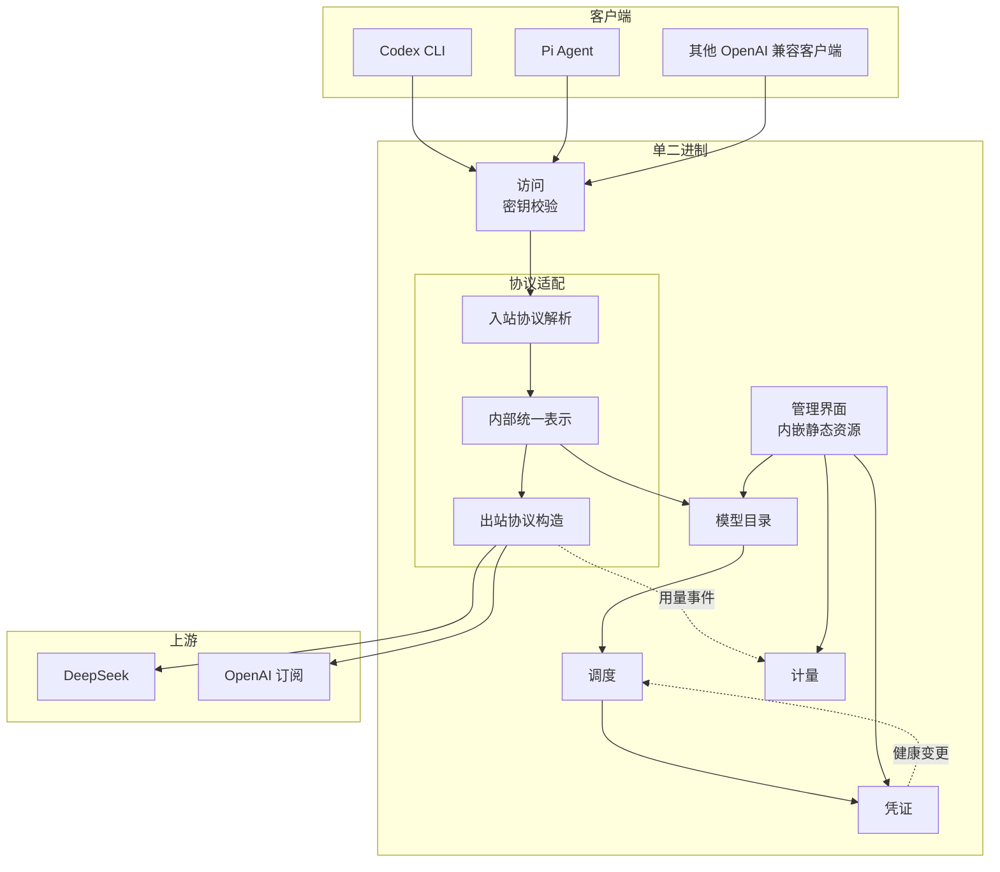

# 系统架构全景

限界上下文划分的模块化单体，内部按 CQRS 垂直切片组织，切片自带入站适配器与用例处理器，入站端口以处理器签名隐式表达；领域层为 DDD 战术模式的充血模型；出站依赖通过端口适配器倒置，端口按读写分离。

## 架构拓扑

协议适配是唯一接触线上协议的地方，入站协议与出站协议都先翻译成内部统一表示再向外，领域模型不感知任何上游协议的字段。

## 技术栈选型

- 运行时与语言：Rust 1.98，单二进制交付，跨 Linux、macOS、Windows
- HTTP 主干：axum + hyper + tower-http + reqwest + tokio。axum 类型隔离在薄适配层，业务逻辑不直接依赖，以应对其 0.9 的破坏性变更
- 持久化：SQLite，WAL 模式，sqlx 访问，迁移脚本随仓库版本化
- 凭据加密：记录级 AEAD，XChaCha20Poly1305，192 位随机 nonce，主密钥取自操作系统凭据库
- 可观测：tracing 做结构化日志，metrics 做指标导出
- 配置：文件承载，SIGHUP 触发重载，arc-swap 原子替换，保留 last-known-good 快照
- 前端：React 19 + Vite 8 + Tailwind v4 + shadcn/ui + TanStack Query + TanStack Table + recharts，构建产物由 rust-embed 嵌入
- 工具链：cargo 构建，just 统一入口，Biome 管前端，cargo-deny 管依赖

## 基础设施

- 错误处理：领域错误按可恢复性分级，对外统一为协议规定的错误结构，不把上游原始错误直接透传给客户端；上游错误在诊断信息里保留来源
- 日志与追踪：每次请求注入请求 ID 与会话 ID，凭证与密钥在日志中脱敏，流式响应记录首字节延迟与总时长
- 超时：分层设置，连接、首字节、单次读、整体上限各自独立，不用单一 deadline
- 优雅关闭：收到终止信号后停止接受新请求，等待在途流式响应结束或超时

## 部署形态

单个二进制，前台进程，监听地址可配。数据文件与配置放在同一台机器上，不跨网络访问数据库。管理界面静态资源在 release 构建期嵌入，debug 期从文件系统读取。
